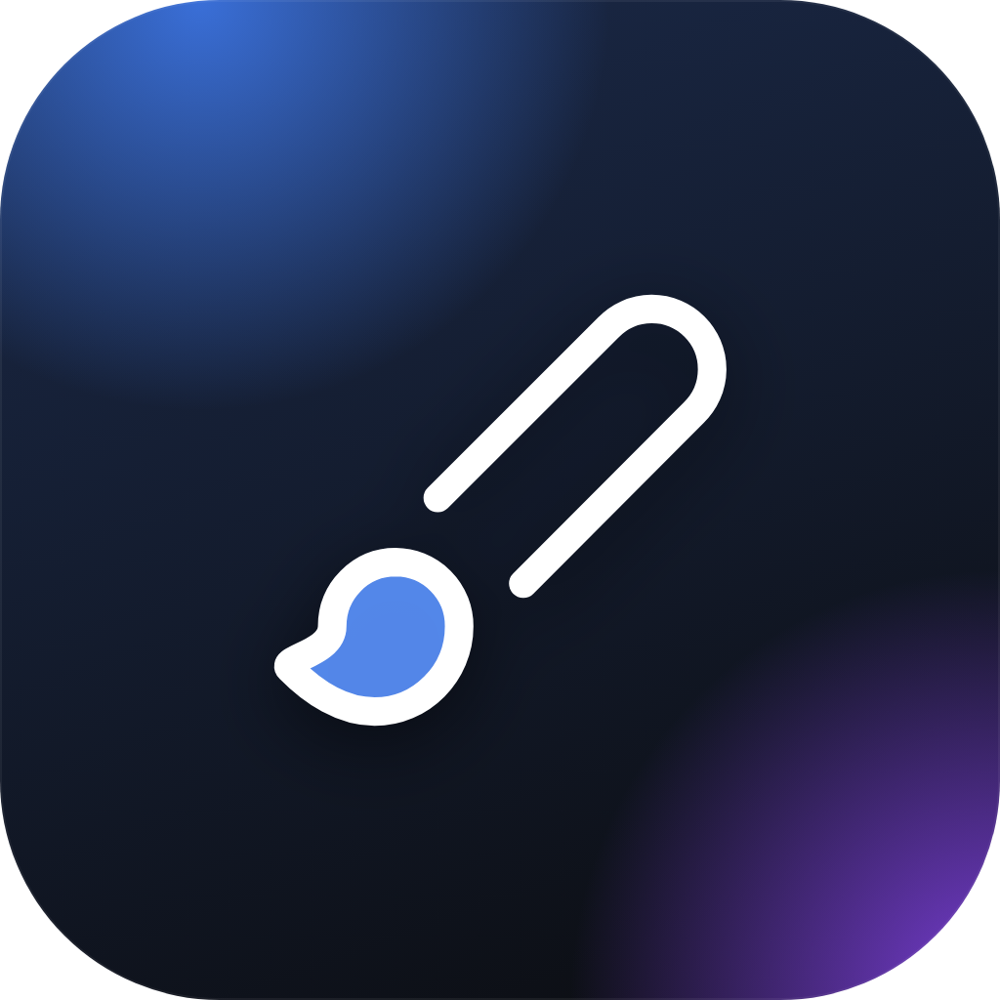
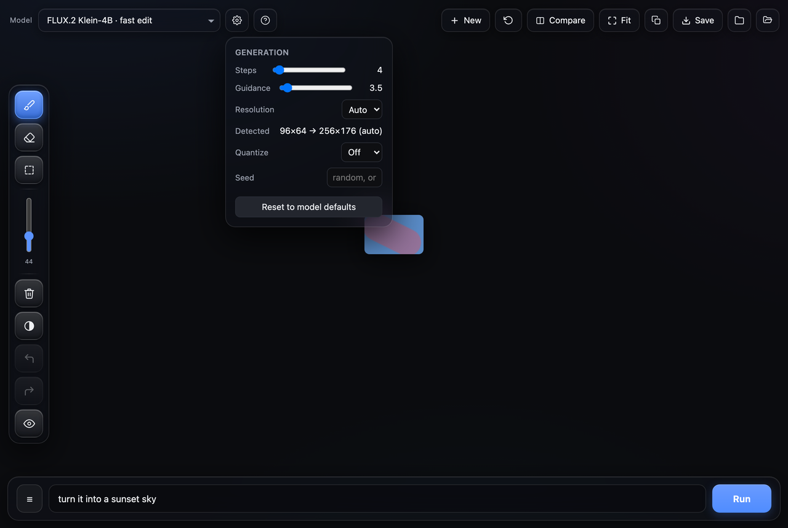

<div align="center">



# mflux-paint

Local FLUX inpaint/edit UI for Apple Silicon, powered by [mflux](https://github.com/filipstrand/mflux) (MLX). No PyTorch, no cloud.

 

</div>



## Requirements

- macOS, Apple Silicon, Python 3.9+
- [mflux](https://github.com/filipstrand/mflux):
  ```
  uv tool install mflux
  ```
  (or `pipx install mflux`) — installs `mflux-generate-*` into your PATH. This app shells out to those binaries directly and auto-detects where they live; edit `BIN` in `server.py` only if it can't find them.

## Install

```bash
git clone https://github.com/Amo643/mflux-paint.git
cd mflux-paint
python3 -m venv .venv
.venv/bin/pip install -r requirements.txt
```

## Usage

**Desktop app** — a real native window, no browser:
```bash
./launch.sh
```
`desktop.py` runs `server.py` in the background and opens it via [pywebview](https://pywebview.flowrl.com/) (WKWebView, no Chrome/Electron). Own window, own Dock icon, closes with the window. Running `launch.sh` again just refocuses it instead of opening a second copy.

For a double-clickable `.app` (no terminal), wrap it with [Platypus](https://sveinbjorn.org/platypus): `platypus -a "mflux paint" -i assets/icon.icns launch.sh`.

**Browser mode** — for remote/headless use:
```bash
python3 server.py
```
then open `http://localhost:7866`. Auto-exits after 20s idle (`MFLUX_NO_IDLE=1` to disable).

## Features

- Brush / eraser / box-select masking, undo/redo, invert, hide/show
- Whole-image edit, true inpaint, or text-to-image, depending on model
- Live per-step progress, cancel mid-run
- Multi-seed batch — comma-separate seeds (`111,222,333`) to generate several variations in one run and pick the best
- Negative prompt, quantization (3–8 bit), custom resolution
- Saved prompts, chained edits, compare-to-original (hold `C`), revert, copy/save/download
- Custom local models — point Settings → Model path at weights you already downloaded, "＋ Save as model" to add it to the picker permanently (based on whichever built-in model matches its shape)

Full shortcut list is in the app (`?` key).

## Models

16 models across **Edit** / **Inpaint** / **Text-to-image**, picked via the model dropdown. ⬇ in the picker marks weights not yet downloaded (fetched automatically on first use, several GB, needs internet).

| Status | Meaning |
|---|---|
| ✅ Tested | Ran for real this session — works |
| ⚠️ Partial | Runs, but one setting (noted below) is unverified |
| 🔴 Failed | Tried, hit an error — noted below |
| ❌ Untested | Wired to match mflux's `--help`, never actually run (no internet available while building this) |

| Model | Category | Status |
|---|---|---|
| FLUX.2 Klein-4B — fast edit | Edit | ✅ |
| FLUX.2 Klein-9B — quality edit | Edit | ⚠️ `gen_max` resolution cap unverified against real 9B weights |
| Qwen-Image-Edit | Edit | ❌ |
| FLUX.1 Kontext — image edit | Edit | ❌ |
| Bria FIBO Edit | Edit | ❌ |
| FLUX.1 Fill — true inpaint | Inpaint | ❌ |
| FLUX.1 dev | Text-to-image | ❌ |
| FLUX.1 schnell | Text-to-image | 🔴 HF folder present but missing its VAE — needs one more download |
| FLUX.2 Klein-4B | Text-to-image | ✅ |
| Qwen-Image | Text-to-image | ❌ |
| Bria FIBO | Text-to-image | ❌ |
| Z-Image / Z-Image Turbo | Text-to-image | ❌ |
| ERNIE-Image / ERNIE-Image Turbo | Text-to-image | ❌ |
| Ideogram4 | Text-to-image | ❌ |

Testing already caught two real mflux argument quirks (FLUX.2 base only accepts `--guidance 1.0`; FLUX.2 rejects `--negative-prompt` entirely) — untested models likely hide a couple more. If one errors, the fix is almost always a one-line change to that model's entry in `MODELS` in `server.py`; mflux's own error message says exactly what's wrong.

Steps/guidance for untested models are mflux's documented values where known, otherwise a generic FLUX.1-dev-style default (steps=20, guidance=3.5) or the standard fast/"turbo" convention (steps=4, guidance=0) — tune in Settings once you've run one for real.

Not included: ControlNet, Depth, Redux, in-context/concept tools, upscalers, train/save/lora-library — they need control maps, depth maps, or multiple reference images, or aren't generation at all, so they don't fit this app's single-image + prompt + optional-mask flow.

## Project layout

- `server.py` — HTTP server, model registry, mflux subprocess orchestration
- `index.html` — the entire frontend (single file, no build step)
- `desktop.py` — native window wrapper (pywebview)
- `launch.sh` — desktop app entry point
- `assets/` — app icon and favicons

## Acknowledgments

- [mflux](https://github.com/filipstrand/mflux) — the MLX engine this app shells out to for every generation
- [pywebview](https://pywebview.flowrl.com/) — native desktop window
- [Pillow](https://python-pillow.org/) — image handling

## License

MIT — see [LICENSE](LICENSE).
